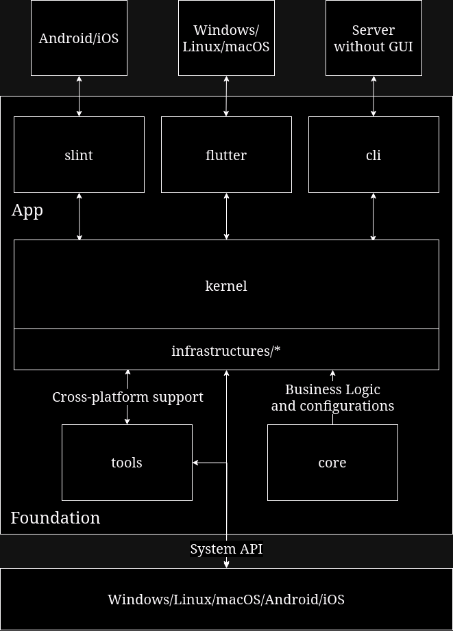

# rdrs-rs(WIP)

## Introduce

Aiming to develop a remote desk control application supports for Windows/Linux(X11/Wayland)/macOS/Android/iOS, as well as a server with no GUI(or a TUI)

## Note

This project is currently in a developing stage, I will give priority to optimizing the architecture. When implementing functions, I will first write them in the form of tests or examples. Finally, if all modules are OK, then assemble them.

I will continue to update this document, including architecture diagrams

## Configuration mechanism

One can configuration this program by a workdir file: `config.toml` or toml files provided by `arguments`, or environment variables with prefix `RDRS` and spliter `__`, For more information, please see [reference code](rdrs-kernel/src/config.rs)

## Roadmap

- [ ] developing slint using `ffmpeg`, `slint` and `webrtc`, aming to realize a simple straming from peer to peer first.
    - Continuously improve the architecture, including major refactoring if necessary
    - [x] video decode
        - [x] decode video from encoded format to original color data
    - [ ] video encode
        - [ ] encode video from original color data to encoded format
    - [x] video play
        - [x] play with slint native interface
        - [ ] play with a opengl underlay
        - [ ] Stabilize this feature
    - [ ] audio play
    - [ ] webrtc connection, video and audio track, and mouse, keyboard datachannel
- [ ] other device features include virtual camera, virtual microphone, usb redirect, disk share, etc
- [ ] metircs

here are [examples](rdrs-slint/examples/).

## architecture

Note: Split infrastructures into crates to decrease build time.

## rdrs-config

Configurations of remote-desk

## rdrs-core

DDD Domains of remote-desk, include models, repositories, and domain services

## rdrs-tools

Cross-platform support and utilities

## rdrs-infrastructures/*

Implementation of technical facilities

## rdrs-kernel

App kernel

## rust-desk-cli

Deploy a machine as remote-desk server without GUI, can be connected by rdrs-flutter and rdrs-slint

## rust-desk-slint

GUI for Windows/Linux/macOS

## rust-desk-flutter

GUI for Android/iOS
