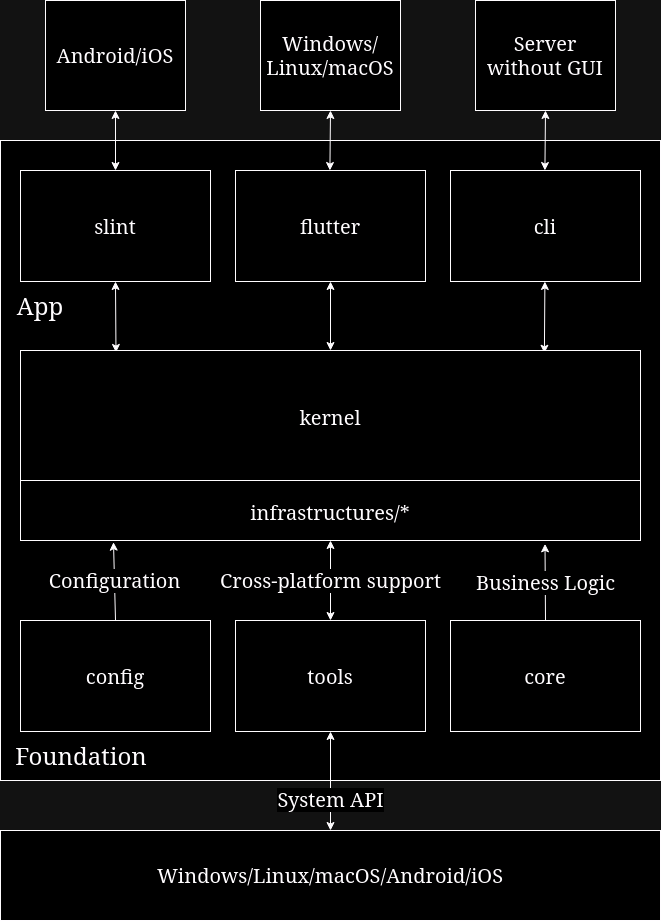

# remote-desk-rs(WIP)

Aiming to develop a remote desk control application supports for Windows/Linux(X11/Wayland)/macOS/Android/iOS, as well as a server with no GUI(or a TUI)

## architecture

Note: Split infrastructures into crates to decrease build time.

## remote-desk-config

Configurations of remote-desk

## remote-desk-core

DDD Domains of remote-desk, include models, repositories, and domain services

## remote-desk-tools

Cross-platform support and utilities

## remote-desk-infrastructures/*

Implementation of technical facilities

## remote-desk-kernel

App kernel

## rust-desk-cli

Deploy a machine as remote-desk server without GUI, can be connected by remote-desk-flutter and remote-desk-slint

## rust-desk-slint

GUI for Windows/Linux/macOS

## rust-desk-flutter

GUI for Android/iOS
